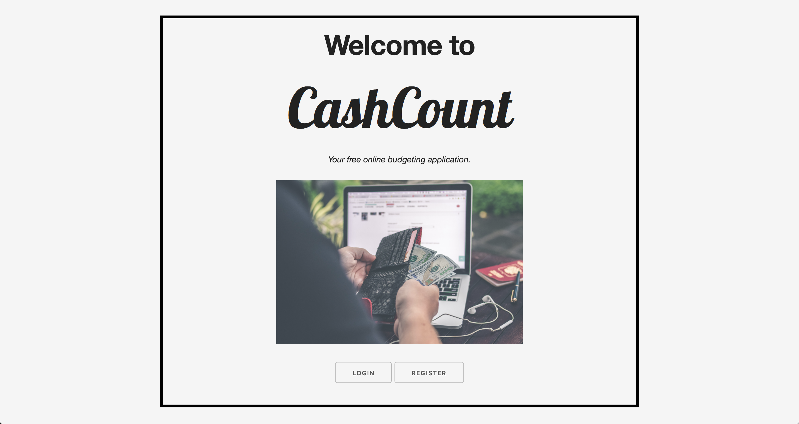
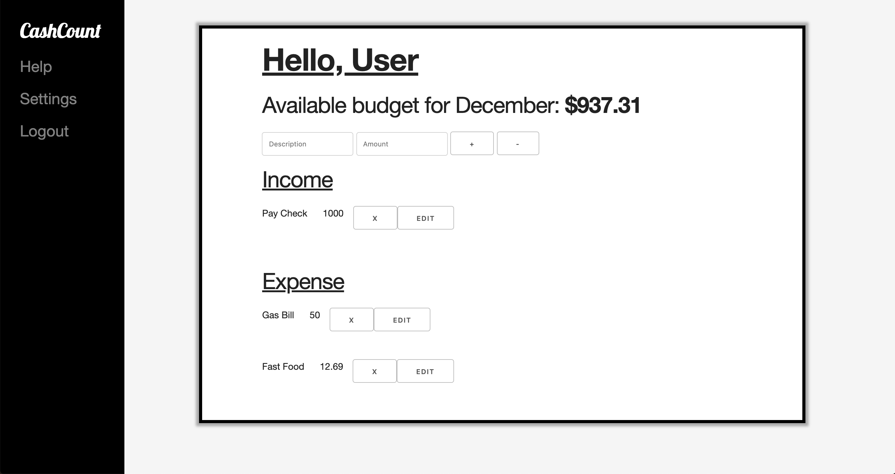

# CashCount

Deployed on: 
[Cash Count](https://cashcountapp.herokuapp.com/)

Online web application for keeping track of one's funds!  

- Registration
- Login
- Dynamic Income and Expense logging
- F.A.Q.
- Password Change
- Mobile Responsive

Technologies used: JavaScript, Node, Express, MongoDB, Mongoose, Embedded JavaScript(EJS), CSS, Animate, and Skeleton. 

 

 
# User Story 
- User starts at the homepage
	- Login/Registration page route is shown
- Once logged in, user will have access to their personalized dashboard.
- Afterwards, can start posting expenses/income in the dashboard page
- Users can also access the hamburger menu to change themes (maybe can upload their custom colors)
- Users can also access the settings page where they can change their password
